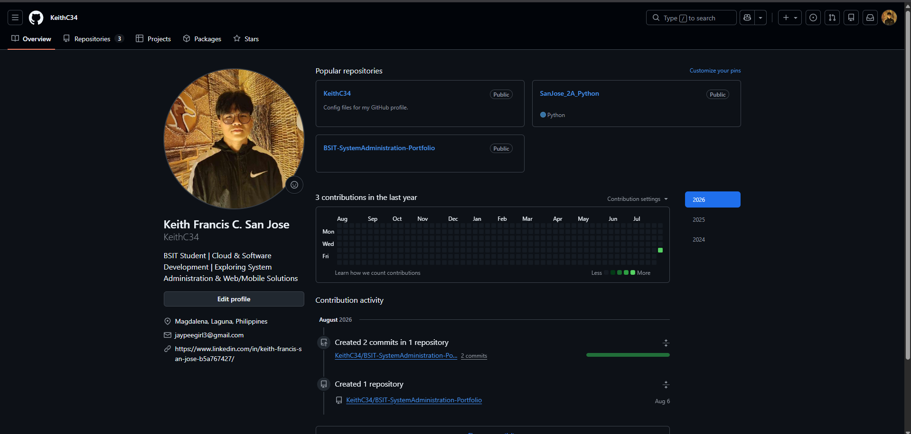
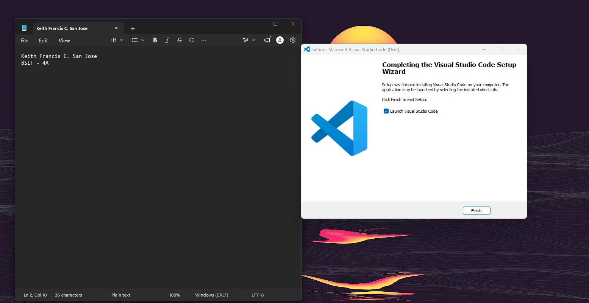
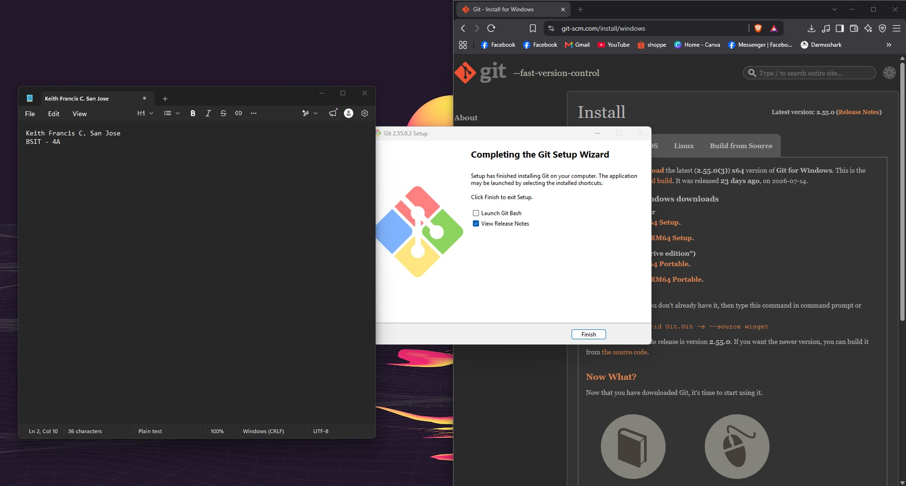
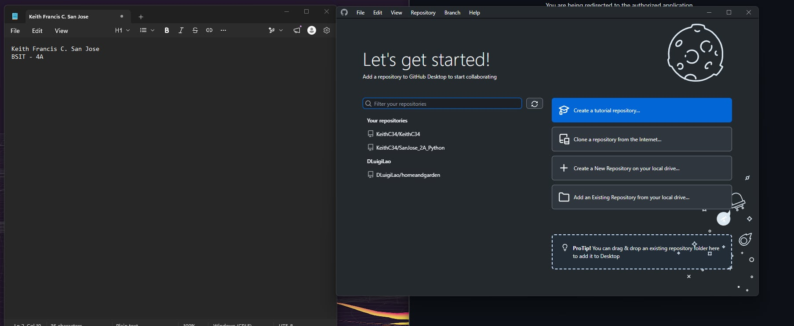
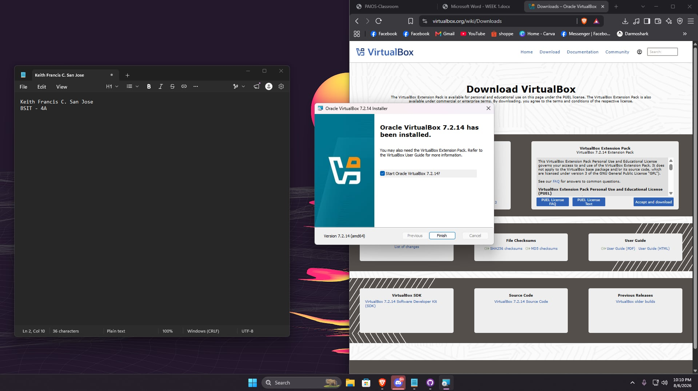
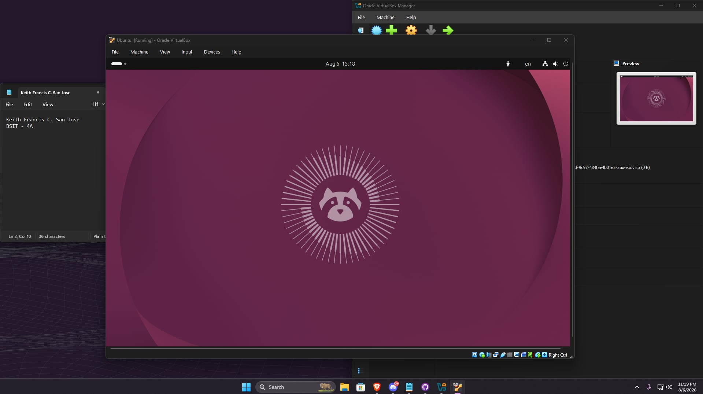
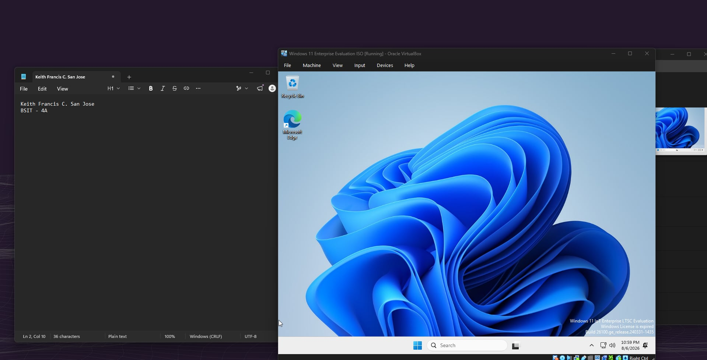

# Week 1 – Building My Professional Environment

## Student Information
* **Name:** Keith Francis C. San Jose
* **Course:** Bachelor of Science in Information Technology (BSIT)
* **Section:** 4A
* **Date:** August 7, 2026

---

# Objectives
1. Set up a standardized local development environment for System Administration coursework.
2. Initialize and configure Git and GitHub Desktop for seamless repository management.
3. Establish a structured semester-long professional portfolio repository (`BSIT-SystemAdministration-Portfolio`).

---

# Software Installed
* **Visual Studio Code:** Primary code editor and terminal environment.
* **Git / GitHub Desktop:** Version control system and GUI client for managing repositories.
* **Oracle VM VirtualBox:** Virtualization platform for hosting guest operating systems.
* **Ubuntu Linux:** Guest operating system installed on VirtualBox for server administration tasks.
* **Windows OS:** Host operating system environment.

---

# Professional Accounts
* **GitHub:** [https://github.com/KeithC34](https://github.com/KeithC34)
* **LinkedIn:** [https://www.linkedin.com/in/keith-francis-san-jose-b5a767427/](https://www.linkedin.com/in/keith-francis-san-jose-b5a767427/)

---
# Installation Screenshots

### Professional Accounts
#### GitHub Account

#### LinkedIn Account

---

### Software Setup
#### VS Code

#### Git

#### GitHub Desktop

#### VirtualBox

#### Ubuntu Linux

#### Windows OS

---

# Challenges Encountered

### 1. Terminal Command Recognition Error
* **Problem:** Running `git` commands in the VS Code PowerShell terminal resulted in a `CommandNotFoundException` because Git path variables were not detected.
* **Solution:** Used **GitHub Desktop** to handle staging, committing, and pushing changes directly, or installed Git for Windows ensuring the "Add to PATH" option was selected before restarting VS Code.

### 2. Folder Naming Format Mismatch
* **Problem:** Initially created week folders with spaces (e.g., `Week 01`), which did not match the strict `WeekXX` requirement in the activity guidelines.
* **Solution:** Executed an automated PowerShell script to systematically rename all directories from `Week 01`–`Week 15` to `Week01`–`Week15`.

### 3. Git Attributes Line Ending Warnings
* **Problem:** Received normalization warnings regarding LF/CRLF text file line endings when tracking `.gitattributes` and `.gitkeep` files across environments.
* **Solution:** Configured global Git line-ending settings (`git config --global core.autocrlf true`) to handle Windows/Linux carriage returns consistently.