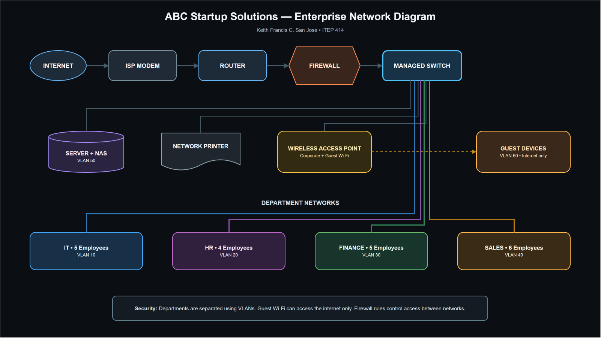

# Week 2 – Enterprise Infrastructure Planning

> **Student:** Keith Francis C. San Jose  
> **Course:** ITEP 414 – System Administration and Maintenance  
> **Scenario:** ABC Startup Solutions (20 employees, single-floor office)  
> **Date:** August 12, 2026

## Project Overview

This project proposes a secure, manageable, and expandable IT infrastructure for **ABC Startup Solutions**, a new software development company with no existing computers, servers, network, internet service, or security policies. The plan translates the company's operational needs into hardware, software, network, security, backup, and staffing recommendations suitable for an initial 20-person deployment.

## Learning Objectives

- Analyze business requirements before purchasing or deploying technology.
- Prepare traceable hardware, software, and network inventories.
- Design a segmented small-enterprise network topology.
- Explain how key system administration roles collaborate.
- Communicate technical recommendations through professional documentation.

## Company Scenario and Profile

| Item | Description |
|---|---|
| Company | ABC Startup Solutions |
| Nature of business | Custom web, mobile, and cloud software development for small and medium enterprises |
| Vision | To become a trusted Philippine technology partner known for secure, practical, and people-centered digital solutions. |
| Mission | To build reliable software, support clients responsibly, and create an environment where employees can innovate securely and efficiently. |
| Fictional office | 8/F One Innovation Center, Nuvali Business District, Santa Rosa, Laguna |
| Work model | Primarily office-based with controlled remote access for approved staff |

### Organizational Structure

The Managing Director oversees four department leads. The **IT Department (5)** develops products and administers infrastructure; **Human Resources (4)** manages employee records and recruitment; **Finance (5)** handles accounting, payroll, and purchasing; and **Sales (6)** manages prospects, customers, and presentations. Total headcount is **20**.

| Department | Employees | Primary technology need |
|---|---:|---|
| Information Technology | 5 | High-performance development workstations, server administration, test virtualization |
| Human Resources | 4 | Secure document handling and reliable office productivity |
| Finance | 5 | Restricted financial data, dependable printing, and protected backups |
| Sales | 6 | Portable laptops, wireless access, presentations, and remote work |
| **Total** | **20** | |

## Hardware Inventory

| Asset ID | Hardware / specification | Qty. | Assignment | Purpose and justification |
|---|---|---:|---|---|
| HW-DT-001 | Business desktop, Core i5/Ryzen 5, 16 GB RAM, 512 GB NVMe | 14 | IT 5, HR 4, Finance 5 | Reliable fixed workstations; IT units may be upgraded to 32 GB for local virtual machines. |
| HW-LT-001 | Business laptop, Core i5/Ryzen 5, 16 GB RAM, 512 GB SSD | 6 | Sales | Mobility for presentations and approved remote work. |
| HW-SV-001 | Tower server, Xeon E-class, 64 GB ECC RAM, RAID-capable storage, dual NIC, 3-year warranty | 1 | Server room | Hosts directory, DNS/DHCP, file, logging, and internal application services using virtual machines. |
| HW-RT-001 | Dual-WAN gigabit router | 1 | Server room | Routes internal networks and supports a future backup ISP. |
| HW-SW-001 | 48-port managed PoE+ switch | 1 | Server room | Provides enough ports, VLAN support, and growth capacity while powering access points. |
| HW-PR-001 | Network multifunction laser printer | 2 | HR/Finance shared; general office | Separates sensitive administrative printing from general workloads and provides scanning. |
| HW-UPS-001 | 2200 VA line-interactive UPS with network management | 1 | Server/network rack | Provides safe shutdown and short-term power continuity for core equipment. |
| HW-UPS-002 | 1000 VA UPS | 2 | HR/Finance printer areas | Protects critical shared equipment from unstable power. |
| HW-AP-001 | Wi-Fi 6 business access point | 2 | Office ceiling | Provides balanced coverage and separate corporate/guest SSIDs. |
| HW-NAS-001 | 4-bay NAS, four 8 TB NAS drives, RAID 6 | 1 | Server room | Central backup target with disk-failure tolerance; RAID is not treated as a backup. |
| HW-BK-001 | 16 TB encrypted external drive | 2 | Rotated on/off site | Supports alternating offline backups and recovery from ransomware or NAS failure. |
| HW-MN-001 | 24-inch IPS monitor | 26 | 20 primary; second display for IT 5; 1 spare | Improves productivity and provides one replacement spare. |

## Software Inventory

Versions should be validated again during procurement so supported releases are deployed.

| Software | Version / edition | License | Purpose |
|---|---|---|---|
| Windows 11 Pro | Current supported release | Commercial/OEM, 20 devices | Business endpoint OS with BitLocker, domain join, and policy management. |
| Ubuntu Server LTS | 24.04 LTS or supported successor | Open source | Stable server platform for internal services, containers, and automation. |
| Microsoft 365 Business Premium | Current cloud service | Subscription, 20 users | Office applications, email, collaboration, identity, device management, and endpoint protection. |
| Visual Studio Code | Current stable | Free | Primary editor for development, scripting, and configuration files. |
| Git | Current stable | GPLv2 | Distributed source control and auditable change history. |
| GitHub Desktop | Current stable | Free | Accessible graphical Git workflow for staff who need it. |
| Oracle VirtualBox | Current supported release | GPLv3 / extension terms reviewed | Local test virtual machines; licensing is reviewed before commercial extension-pack use. |
| Google Chrome Enterprise | Current stable | Free | Standards-compatible browser with centralized policy support. |
| Microsoft Defender for Business | Current service | Included with selected Microsoft 365 plan | Endpoint detection, antivirus, vulnerability management, and centralized response. |
| AnyDesk | Current business release | Commercial subscription | Approved attended remote support; access is restricted, logged, and protected by MFA. |
| 7-Zip | Current stable | LGPL/BSD | Secure handling of common archive formats. |

## Network Inventory

| Asset ID | Network component | Qty. | Key requirement | Purpose |
|---|---|---:|---|---|
| NET-MD-001 | ISP optical network terminal/modem | 1 | ISP-managed bridge/pass-through mode | Terminates the business fiber service. |
| NET-RT-001 | Dual-WAN router | 1 | Gigabit throughput, VPN, QoS | WAN routing and future secondary-ISP failover. |
| NET-FW-001 | Next-generation firewall appliance | 1 | VLANs, IPS, application control, VPN, web filtering | Enforces policy between the internet and internal VLANs. |
| NET-SW-001 | 48-port managed PoE+ switch | 1 | 802.1Q VLAN, STP, LACP, SNMP | Connects wired endpoints and powers access points with room for growth. |
| NET-AP-001 | Wi-Fi 6 access point | 2 | WPA3, multiple SSIDs, VLAN tagging | Provides corporate and isolated guest wireless coverage. |
| NET-PP-001 | 48-port CAT6 patch panel | 1 | Rack-mounted and labeled | Organizes permanent cabling and simplifies troubleshooting. |
| NET-CB-001 | CAT6 solid-core cable | 2 × 305 m boxes | Certified gigabit runs | Supports structured cabling for all desks, APs, printers, and spare outlets. |
| NET-RJ-001 | CAT6 RJ45 keystone/connectors | 60 | Standards-compliant, tested | Terminates planned drops plus spares; permanent links use keystone jacks. |
| NET-RK-001 | Lockable 18U rack and cable management | 1 | Grounded, ventilated | Protects and organizes the patch panel, firewall, switch, and UPS. |
| NET-TL-001 | Cable tester and labeling kit | 1 set | Wiremap and length testing | Verifies every run and supports accurate documentation. |

## Enterprise Network Diagram

The firewall terminates remote-access VPN and routes six VLANs: IT (10), HR (20), Finance (30), Sales (40), Servers (50), and Guest (60). Access-control rules deny direct guest access to internal resources, restrict HR and Finance data to authorized users, and expose server services only as required. Management interfaces are limited to the IT VLAN. This logical segmentation reduces lateral movement while retaining a simple single-switch design appropriate for 20 employees.

## System Administration Roles

### Helpdesk Technician

The helpdesk technician receives, prioritizes, documents, and resolves user incidents; provisions approved accounts and devices; supports operating systems and office applications; and escalates recurring or high-impact problems. Important skills include patient communication, structured troubleshooting, ticket documentation, Active Directory/Entra ID fundamentals, and safe remote support. Common tools include ticketing systems, remote-assistance software, knowledge bases, endpoint-management portals, and hardware diagnostics. Useful entry certifications include **CompTIA A+**, **ITIL 4 Foundation**, and **Microsoft 365 Fundamentals**.

### Network Administrator

The network administrator designs and maintains switching, routing, VLANs, Wi-Fi, VPN, addressing, monitoring, and network security controls. The role requires TCP/IP, DNS, DHCP, subnetting, firewall-policy, packet-analysis, and structured-cabling skills. Typical tools include switch/firewall consoles, Wireshark, Nmap, PuTTY/SSH, configuration backups, and SNMP monitoring. Relevant certifications include **Cisco CCNA**, **CompTIA Network+**, and vendor firewall certifications.

### Linux System Administrator

The Linux administrator installs, hardens, patches, monitors, backs up, and automates Ubuntu services and virtual machines. Essential skills include the shell, permissions, systemd, storage, networking, logs, SSH, scripting, configuration management, and recovery. Common tools include Bash, OpenSSH, journalctl, Ansible, Git, rsync, cron/systemd timers, and monitoring platforms. Relevant certifications include **Linux Professional Institute LPIC-1**, **CompTIA Linux+**, and **Red Hat RHCSA**.

### Cloud Administrator

The cloud administrator manages cloud identities, subscriptions, workloads, storage, networking, budgets, monitoring, and recovery while applying least privilege and governance. The role needs IAM, virtual networking, automation, cost-control, security, and incident-response skills. Common tools include Microsoft Entra and Azure portals, Azure CLI/PowerShell, Terraform, cloud monitoring, and Microsoft 365 administration. Relevant certifications include **Microsoft Azure Administrator Associate**, **AWS Certified SysOps Administrator – Associate**, and entry cloud fundamentals credentials.

### How the roles collaborate

The helpdesk provides the first view of user impact and records repeatable evidence; network and Linux administrators investigate infrastructure paths and server services; and the cloud administrator checks identity, hosted services, and cloud controls. They coordinate through one ticket and change-management process, share monitoring alerts and documentation, test changes before deployment, and jointly review incidents. Clear ownership and escalation allow the team to restore service quickly without bypassing security or creating conflicting fixes.

## Infrastructure Recommendations

### Internet provider

Procure a **business-grade fiber plan with at least 500 Mbps symmetric bandwidth**, a static public IP, service-level support, and bridge/pass-through capability. Select the provider only after checking serviceability and written SLA terms at the fictional site. Add a second provider or 5G business connection when operations depend on continuous client access; dual-WAN failover avoids a single carrier failure.

### Server and platform

Use one warrantied tower server with a recent Xeon E-class processor, **64 GB ECC RAM**, hardware-supported RAID, mirrored SSDs for the hypervisor, and redundant-capacity storage for workloads. Virtualize directory/DNS, file, monitoring/logging, and internal application services, but keep resource reservations and documented recovery procedures. The recommended specification supports current services and moderate growth without buying data-center-scale hardware.

### Backup strategy

Apply the **3-2-1 rule**: production data plus backups on the NAS and an encrypted off-site/cloud or rotated offline drive. Run daily incremental and weekly full backups, retain monthly recovery points, encrypt backup media, limit backup-administrator access, and automate failure alerts. Test a file restore monthly and a complete service recovery quarterly. Snapshots and RAID improve availability but do not replace independent backups.

### Security, antivirus, and passwords

- Enforce least privilege, separate administrator accounts, MFA for email, VPN, cloud, and privileged access, and rapid removal of leavers.
- Segment departments and guests with VLANs and default-deny inter-VLAN firewall rules; allow only documented business services.
- Enable BitLocker, Secure Boot, automatic screen lock, centralized patching, Defender for Business, email filtering, and tested incident-response procedures.
- Maintain asset, account, network, backup, vendor, and change records; review alerts and firewall rules on a schedule.
- Require passphrases of **at least 14 characters**, block common/compromised passwords, avoid routine forced changes unless compromise is suspected, and use an approved password manager. MFA is mandatory for high-risk access.

### Expansion plan

The 48-port switch, structured cabling spares, two scalable APs, modular server memory/storage, and dual-WAN router provide headroom toward approximately 35–40 staff. Review utilization quarterly. Before exceeding switch, wireless, or server thresholds, add a stacked/access switch, perform a wireless survey, expand compute or migrate appropriate services to the cloud, and update diagrams and inventories through change control.

## Technologies Used

- Markdown and Git/GitHub for versioned documentation
- PNG for the final network diagram
- Windows 11 Pro, Ubuntu Server, Microsoft 365, Git, and VS Code in the proposed stack
- VLANs, WPA3, VPN, next-generation firewalling, centralized endpoint security, and 3-2-1 backups

## Challenges Encountered

The main design challenge was balancing startup cost with security and future growth. A single managed PoE switch and one virtualization server keep the first deployment understandable, while VLAN separation, backup media, spare ports, and modular capacity avoid an unsafe or immediately obsolete design. A second challenge was separating products that overlap—router, firewall, NAS, RAID, snapshots, and backups—so that each recommendation has a clear function and no single control is mistaken for complete protection.

## Personal Reflection

This project taught me that system administration begins long before installing an operating system or connecting a cable. I learned to start with the organization: its employees, departments, data, daily work, risks, and expected growth. Those requirements then guide every technical choice. Preparing inventories also showed me that an equipment list becomes more useful when every item has an owner, quantity, purpose, and justification. I now understand why documentation must be clear enough for another administrator or manager to review and continue the work.

The most challenging task was designing the network topology. I had to connect the internet, router, firewall, switch, access points, server, printers, and four departments without making the design unnecessarily complex. VLANs helped solve this problem because they allow one managed switching environment to separate IT, HR, Finance, Sales, servers, and guests logically. I also had to consider which connections should be permitted. For example, guests should reach the internet but not internal systems, while management interfaces should only be available to authorized IT staff.

Planning is important before deployment because early decisions affect security, cost, reliability, and future maintenance. Purchasing hardware without checking capacity could create waste or force an early replacement. Deploying a flat network could expose sensitive HR and Finance information. Treating RAID as a complete backup could leave the company unprepared for deletion, ransomware, or site loss. A written plan gives management an opportunity to verify assumptions, compare priorities, and approve controls before changes become expensive.

This activity will help me become a better System Administrator because it trained me to connect technical knowledge with business needs. Instead of choosing a product only because it is powerful or familiar, I must explain what problem it solves, how it will be secured, who will maintain it, and how it can be recovered. I also practiced presenting infrastructure in inventories, diagrams, recommendations, and professional Markdown. In future projects, I will use the same requirements-first approach and keep documentation updated as the environment changes.

## References

- [CISA Cyber Guidance for Small Businesses](https://www.cisa.gov/audiences/small-and-medium-businesses)
- [NIST Small Business Cybersecurity Corner](https://www.nist.gov/itl/smallbusinesscyber)
- [NIST Digital Identity Guidelines: Authentication and Lifecycle Management](https://pages.nist.gov/800-63-4/sp800-63b.html)
- [Microsoft Defender for Business documentation](https://learn.microsoft.com/defender-business/)
- [Microsoft password policy recommendations](https://learn.microsoft.com/microsoft-365/admin/misc/password-policy-recommendations)
- [Ubuntu Server documentation](https://documentation.ubuntu.com/server/)
- [Cisco: What Is a VLAN?](https://www.cisco.com/c/en/us/products/switches/what-is-a-vlan.html)
- [CISA: Back Up Business Data](https://www.cisa.gov/secure-our-world/back-up-business-data)

See [references/README.md](references/README.md) for source-use notes. Certification names and requirements can change, so official vendor pages should be checked before pursuing an exam.

## Deliverables

- [Enterprise Infrastructure Plan (PDF)](EnterpriseInfrastructurePlan.pdf)
- [Network Diagram (PNG)](diagrams/EnterpriseNetworkDiagram.png)
- [LinkedIn Post Draft](LinkedInPost.md)
